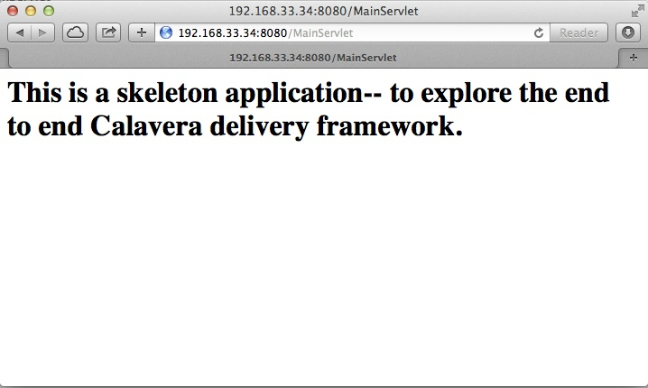

# IT Infrastructure Lab 4 Instructions #
**Overview** 

Lab objectives: 

To undes

In this lab, you will initialize a Vagrant machine that has been preconfigured as a simple developer workstation with:

* Java
* JUnit
* Ant
* Tomcat
* git

**Prerequisites**

You must have completed lab 3 and issued pull requests for me.

**Clone the Calavera project**

Log into the main server via ssh in the usual way. 

Make sure you are in your home directory.

    cd ~

Clone the Calavera project (SEIS660 spring 2015 fork). 

````
teststu1@seis660:~$ git clone https://github.com/StThomas-SEIS660/Calavera.git
Cloning into 'Calavera'...
remote: Counting objects: 841, done.
remote: Compressing objects: 100% (401/401), done.
remote: Total 841 (delta 349), reused 823 (delta 331)
Receiving objects: 100% (841/841), 43.76 MiB | 1.60 MiB/s, done.
Resolving deltas: 100% (349/349), done.
Checking connectivity... done.
````
Change to the Calavera directory:
    
    teststu1@seis660:~$ cd Calavera/

Now, you will see a new Vagrantfile. Have a look at it:

    teststu1@seis660:~/Calavera$ more Vagrantfile
    
(You can hit the space bar to go through it, or q to exit.)

There are a number of machines defined, such as 


````
###############################################################################
###################################    base   #################################
###############################################################################
````

Each section like that defines how Vagrant should bring up a machine and configure it. There are a number of new comamnds we haven't seen before. Let's focus on the following:

````
#manos.vm.provision 	    	:shell, path: "./shell/manos.sh"
manos.vm.provision :chef_zero do |chef|
chef.cookbooks_path = ["./cookbooks/"]
chef.add_recipe "shared::default"
chef.add_recipe "git::default"
chef.add_recipe "localAnt::default"
chef.add_recipe "java7::default"   
chef.add_recipe "tomcat::default"
chef.add_recipe "shared::_junit"
chef.add_recipe "manos::default"
````

You used a shell provisioner in your previous lab to apply your script to your new VM. But what's this? It's commented out here (the # means that Vagrant won't execute that line). 

Instead, we are starting to use Chef. As we discussed in Lecture 03, Chef is a configuration management system. Now, a full treatment of Chef is beyond the scope of this class. However, you should look at a few things. You should still be in your Calavera directory. Run tree:

````
teststu1@seis660:~/Calavera$ tree
.
├── Berksfile
├── cookbooks
│   ├── base
│   │   ├── metadata.rb
│   │   └── recipes
│   │       └── default.rb
│   ├── brazos
│   │   ├── metadata.rb
│   │   └── recipes
│   │       └── default.rb
│   ├── cara
│   │   ├── metadata.rb
│   │   └── recipes
│   │       └── default.rb
│   ├── cerebro
│   │   ├── files
│   │   │   └── post-receive
│   │   ├── metadata.rb
│   │   └── recipes
│   │       └── default.rb
│   ├── espina
│   │   ├── files
│   │   │   └── artifactory-3.5.1.zip
│   │   ├── metadata.rb
│   │   └── recipes
│   │       └── default.rb
│   ├── hombros
│   │   ├── files
│   │   │   ├── hijoInit.xml
│   │   │   └── jenkins-cli.jar
│   │   ├── metadata.rb
│   │   └── recipes
│   │       └── default.rb
│   ├── java7
│   │   ├── attributes
│   │   │   └── default.rb
│   │   ├── metadata.rb
│   │   └── recipes
│   │       └── default.rb
│   ├── localAnt
│   │   ├── attributes
│   │   │   └── default.rb
│   │   ├── files
│   │   │   └── ant.sh
│   │   ├── metadata.rb
│   │   └── recipes
│   │       └── default.rb
│   ├── manos
│   │   ├── files
│   │   │   ├── build.xml
│   │   │   ├── Class1.java
│   │   │   ├── INTERNAL_gitignore
│   │   │   ├── MainServlet.java
│   │   │   ├── TestClass1.java
│   │   │   └── web.xml
│   │   ├── metadata.rb
│   │   └── recipes
│   │       └── default.rb
│   ├── shared
│   │   ├── files
│   │   │   ├── calaverahosts
│   │   │   └── ssh.sh
│   │   ├── metadata.rb
│   │   └── recipes
│   │       ├── default.rb
│   │       └── _junit.rb
│   └── test
│       ├── metadata.rb
│       └── recipes
│           └── default.rb
├── docs
│   └── img
│       ├── CalaveraArchitecture.jpg
│       ├── Jenkins integrated.jpg
│       ├── Jenkins master-slave.jpg
│       ├── Simplified.jpg
│       └── skull.jpg
├── Gemfile
├── LICENSE
├── metadata.rb
├── README.md
├── shared
│   ├── ant.sh
│   └── README.txt
├── startup.bat
├── startup.sh
└── Vagrantfile

34 directories, 53 files
````

Hint: if you are getting garbage characters like âââ in your tree, see this:

http://unix.stackexchange.com/questions/61293/how-can-i-change-locale-encoding-to-avoid-getting-weird-characters-in-terminal

This directory structure is the entire Calavera project, which is a simple DevOps simulation that all runs through Vagrant. 

Again, notice in the Vagrantfile the directives:

    manos.vm.provision :chef_zero do |chef|
    
The above tells Vagrant to use Chef to set up the virtual machine.

    chef.cookbooks_path = ["./cookbooks/"]
    
The above tells Chef where the cookbooks are.

````
chef.add_recipe "shared::default"
chef.add_recipe "git::default"
chef.add_recipe "localAnt::default"
chef.add_recipe "java7::default"   
chef.add_recipe "tomcat::default"
chef.add_recipe "shared::_junit"
chef.add_recipe "manos::default"
````

Finally, the above tells Chef to apply a series of recipes from various parts of the tree. These recipes install software and configure the system in various ways. 

*Have a look at some of them.*  Use "cat."

The combination of these recipes precisely describes what the virtual machine will look like. If you delete a VM and bring it back up, it should look exactly the same every time. 

Now, the current Vagrantfile is a little dangerous, because if you type "vagrant up" it will try to bring up ALL of the machines. So, I have created a branch in git with a Vagrantfile for just the manos machine. Let's switch to that. 

Return to the Calavera base directory and issue the following:

````
teststu1@seis660:~/Calavera$ cd ~/Calavera/
teststu1@seis660:~/Calavera$ git checkout Lab-04
Branch Lab-04 set up to track remote branch Lab-04 from origin.
Switched to a new branch 'Lab-04'
teststu1@seis660:~/Calavera$ 
````
Now, do "cat Vagrantfile". You should see that Manos is the only machine left. Vagrant up manos:

    teststu1@seis660:~/Calavera$ vagrant up manos
    
Manos comes preconfigured with a running Tomcat instance and a simple test-harness based Java application. You can see it running when you ssh in:

````
teststu1@seis660:~/Calavera$ vagrant ssh
Welcome to Ubuntu 14.04.2 LTS (GNU/Linux 3.13.0-24-generic x86_64)

 * Documentation:  https://help.ubuntu.com/
Last login: Sat Feb 21 22:03:53 2015 from 10.0.2.2
vagrant@manos:~$ curl localhost:8080/MainServlet
<h1>This is a skeleton application-- to explore the end to end Calavera delivery framework.</h1>
````
What is "curl"? curl is like a browser for the command line. Because we haven't yet set up XWindows (and I am not sure we will get to that this semester given the overhead) we can't run Chrome, IE or Firefox to see the application. But, if you had a browser able to connect to the virtual machine, it would show:



Curl the localhost

(Lab lecture on Java, Tomcat, JUnit and Ant)

Inspect the java code

Inspect the ant

Answer some questions about it - do a little web research

Change the code in a harmless, visible way

Rebuild & view via localhost

check in locally

Change the code in a way that breaks the test

Rebuild with ant

Revert to the previous version


Try something w/ vagrant up test - translate your script to the chef recipe. 


